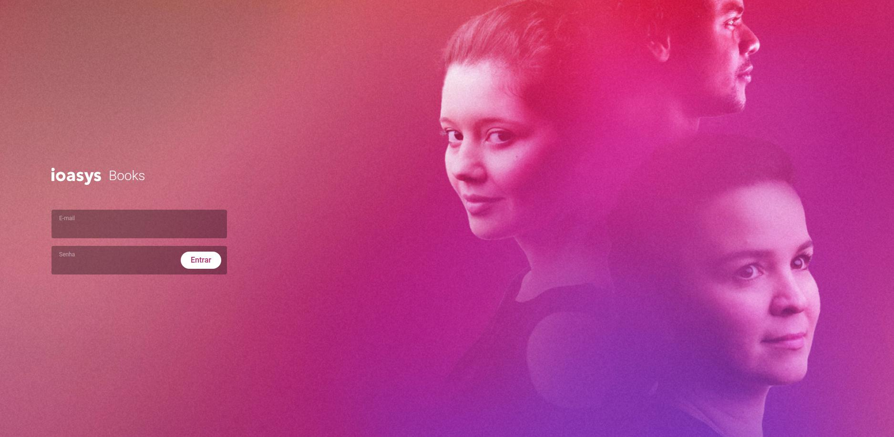
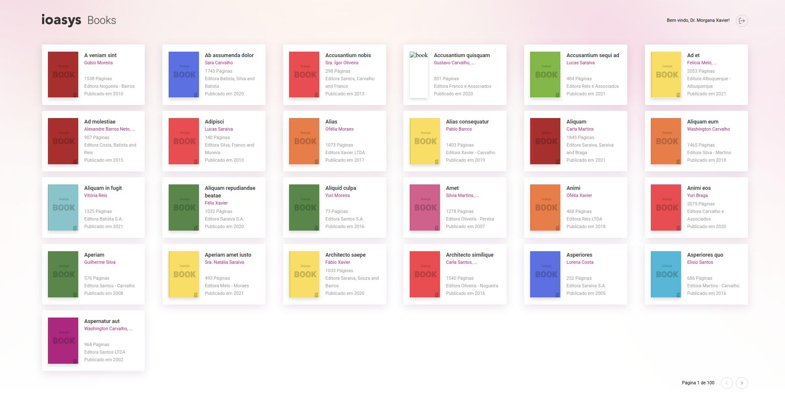
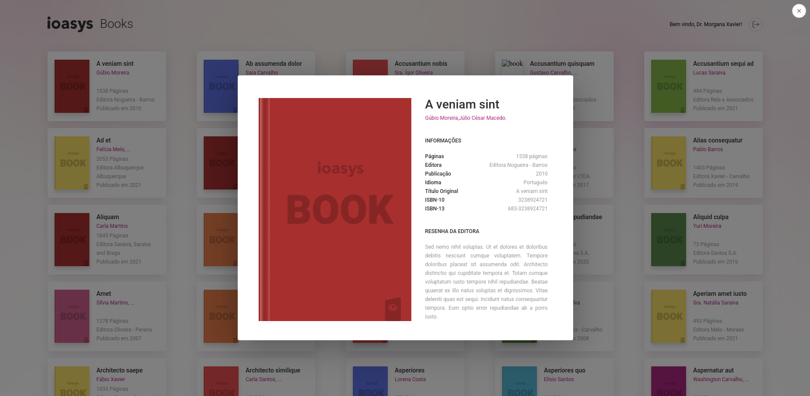

# Teste técnico IOASYS
Este teste foi realizado avaliar os conhecimentos e habilidades em frontend (HTML, CSS, JavaScript e React).

## Objetivo do teste
O desafio é desenvolver um WebApp criando layout de acordo com Figma, realizar autenticação e consumir dados por API externa.  

## Tecnologias utilizadas
O frontend do teste foi desenvolvido utilizando o framework React.JS. Além disso também foram utilizados bibliotecas como:
```
* Axios
* React-Router-DOM
* React-modal
* Styled-components

```
O projeto também possui:
```
* Uso de Context
* Conceito de Mobile First
* Responsividade adaptada para breakpoint;
* Consumo da API externa pelo frontend
* Acesso mostruário de produtos após Autenticação
```
O app foi desenvolvido para ser o mais fiel aos layouts oferecidos do Figma e utilizando os dados da API já estabelecidos.

Prévia do Layout desenvolvido:






## Como iniciar o desenvolvimento

Rodar frontend:
```
* Instale o [npm](https://nodejs.org/en/download/)
* Faça o clone do projeto
* Instale as dependências com npm install
* Use npm start/yarn start na pasta para iniciar o projeto.
* Acesse http://localhost:3000
* Utilize os dados abaixo para realizar o login:

Usuário de Teste: desafio@ioasys.com.br
Senha de Teste: 12341234
